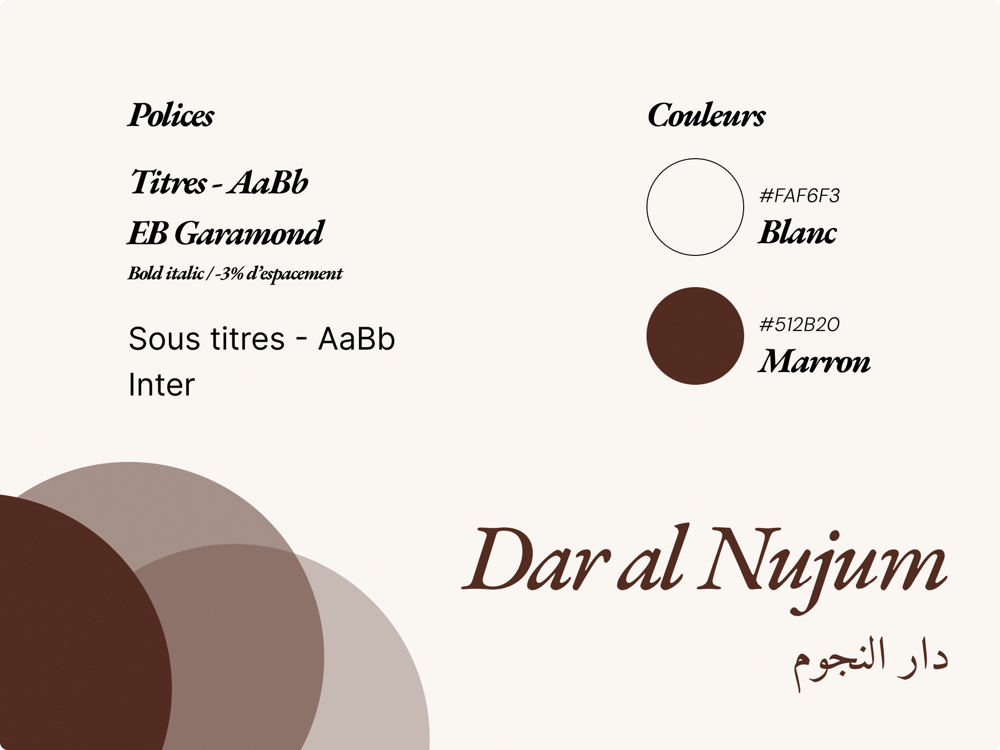

# 🕌 Dar al Nujum — Site vitrine

## 🌟 Présentation
**Dar al Nujum** est un site vitrine réalisé dans le cadre du **projet final USAL33 (HTML & CSS)**.  
Le site est une vitrine pour un restaurant raffiné dans le thème du Maghreb.

En pratique :
- Une **sémantique HTML5** complète
- Un **responsive design** avec **Flexbox** et **Grid**
- Une **charte graphique cohérente**
- Le respect des **pratiques d’accessibilité** et d’organisation

---

## 🧭 Objectif du projet
> Créer un site web statique avec au moins 3 pages en utilisant **uniquement HTML & CSS**.

---

## 📄 Pages du site

| Page | Description |
|------|--------------|
| `index.html` | Page d’accueil — Présentation du restaurant |
| `menu.html` | Menu du restaurant — Entrées, plats, desserts |
| `contact.html` | Formulaire de contact et de réservation |

---

## 🧱 Technologies utilisées

- **HTML5** — structure sémantique
- **CSS3** — mise en page responsive (Flexbox, Grid)
- **Google Fonts**

---

## 🎨 Charte graphique



---

## 📱 Responsive Design
Le site est **mobile-first** et s’adapte à toutes les résolutions :
- Smartphone (≤ 600px)
- Tablette (~768px)
- Bureau (≥ 1024px)

---

## ⚙️ Structure du projet

```
dar-al-nujum/
│
├── index.html        # Page d'accueil
├── menu.html         # Page du menu
├── contact.html      # Page de contact
│
├── css/
│   └── style.css     # Feuille de style principale
│
├── images/           # Images
│
└── README.md         # Vue d'ensemble du projet
```

---

## 🚀 Mise en ligne

Le site sera accessible à l’adresse :  
[https://buchtioof.github.io/dar_al_nujum/](https://buchtioof.github.io/dar_al_nujum/)

---

## 📅 Date de rendu
**07 novembre 2025** — Projet final USAL33
